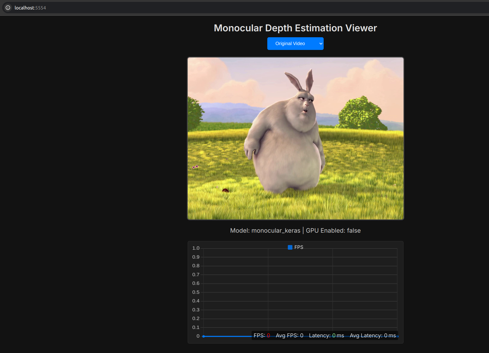
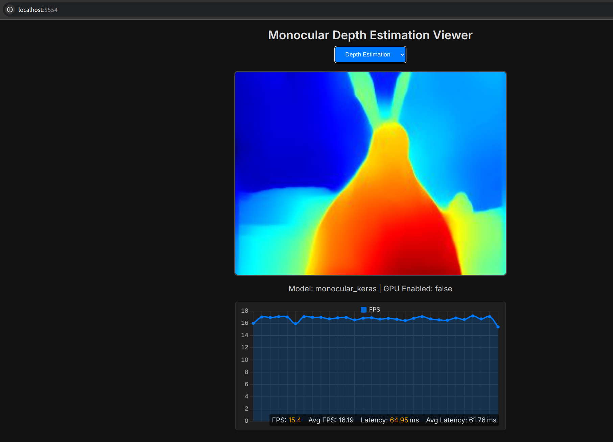

## Setup

1. **Prepare models:**

   ```bash
   python3 app/models/download_keras_model.py
   ```

2. **Build the Docker image (CPU or GPU):**

   ```bash
   ./build.sh        # CPU
   ./build.sh --gpu  # GPU
   ```

## Usage: Standalone Local Execution

* **Keras model (default):**

  ```bash
  ./start_app_cpu.sh python3 app.py -m default
  ```

* **SOL-optimized model (CPU):**

  ```bash
  ./start_app_cpu.sh python3 app.py -m deploy
  ```

* **Test mode (looped video, CPU):**

  ```bash
  ./start_app_cpu.sh python3 app.py -m deploy --test
  ```

* **Test mode with GPU:**

  ```bash
  ./start_app_gpu.sh python3 app.py -m deploy --test --gpu
  ```

---

## Demo: Remote Execution with vAccel

**On the GPU server:**

```bash
./start_vaccel_server.sh
```

This launches:

* A GPU-enabled vAccel container on port `8192`
* A CPU-only vAccel container on port `8193`

**On the robot (client):**

```bash
./start_vaccel_robot.sh --rpc tcp://10.5.1.21:8192
```

Then, execute the app inside the container:

* **Using GPU (remote):**

  ```bash
  docker exec -it vaccel-robot python3 app.py -m deploy --vaccel --gpu --test
  ```

* **Using CPU (remote):**

  ```bash
  docker exec -it vaccel-robot bash -c "export VACCEL_RPC_ADDRESS=tcp://10.5.1.21:8193 && python3 app.py -m deploy --vaccel --test"
  ```

## Web Interface

Open your browser at [http://10.5.1.21:5554/](http://10.5.1.21:5554/) to view live video




