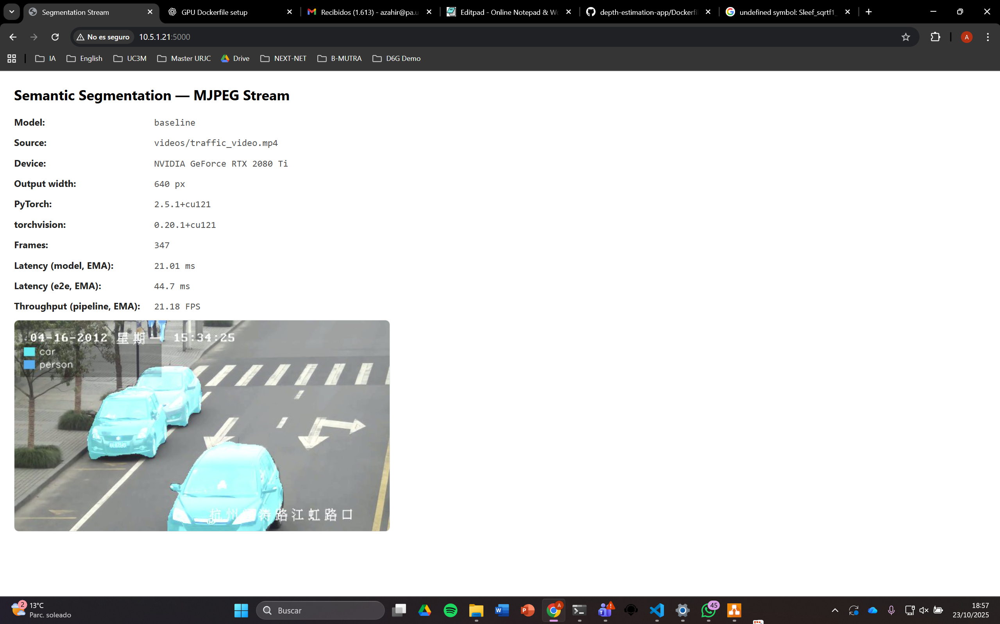

# Computer vision: Real-time Semantic Segmentation App

## Setup

1. **Build the Docker image (CPU or GPU):**

```bash
./build.sh        # CPU
./build.sh --gpu  # GPU
```

2. **Get models:**

- Pytorch (baseline)
```bash
docker run --rm -it -v "./app/models":/models -w /models --entrypoint "" semantic-segmentation-app bash -lc "python3 get_baseline_model.py"
```

- SOL-optimized: Copy the corresponding files in the [app/models/sol_deeplabv3_resnet50/](app/models/sol_deeplabv3_resnet50/) folder

3. **Run example:**

```bash
./run_baseline_cpu.sh
```
---
```bash
./run_baseline_gpu.sh
```
---
```bash
./run_sol_cpu.sh
```

Web interface at [http://10.5.1.21:5000/](http://10.5.1.21:5000/)


